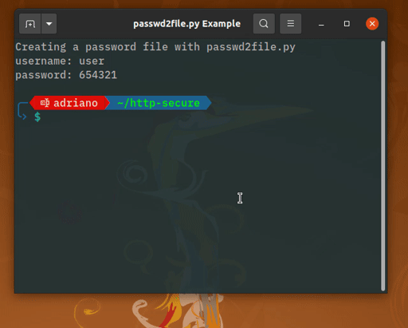
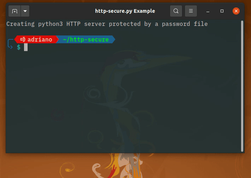
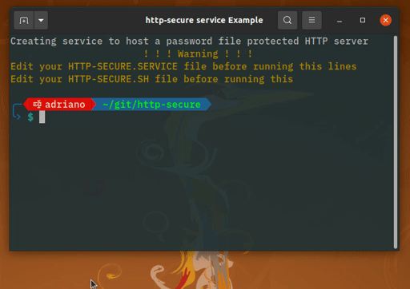

# http-secure
Protect your python HTTP server with a password file!
Works on <b>Linux</b>

## 0. Basic Usage
Create a password file using ```passwd2file.py```:
```
python3 passwd2file.py # type your password and user
```
Then modify ```http-secure.sh``` with a text editor to the following changes:
* Type your path to ```passwd2file.py``` (mandatory);
* Type your path to ```.passwd``` file (mandatory);
* Set the desired port (optional);
* Set the desired target path (optional).

Then modifty ```http-secure.service``` with a text editor to the following change:
* Type your user name in ```User=``` field;
* Type your path to ```http-secure.sh``` in ```ExecStart=``` field.

Lastly, copy the ```http-secure.service``` file to your ```systemd``` scripts folder and activate it:
```
sudo cp http-secure.service /etc/systemd/system/
sudo systemctl daemon-reload
sudo systemctl enable http-secure.service
sudo systemctl start http-secure.service
```

The following steps are designed for advanced usage and setup.

## 1. passwd2file.py

### 1.1 Help
```
$ python3 passwd2file -h
usage: passwd2file [-h] [--path PATH]

Creates a password file according to Basic WWW-Authenticationi Scheme RFC 7617

optional arguments:
  -h, --help            show this help message and exit
  --path PATH, -p PATH  specify password file path (default: /home/adriano/.passwd-files/http-secure.passwd)
```
### 1.2 Example:


input:
```  # ...on 
    $ python3 passwd2file.py --path .
```

output:
```
    Type username: user
    Type password: 654321
    Password file created at ./http-secure.passwd
 ```
## 2. http-secure.py
### 2.1 Help
```
$ python3 http-secure.py -h
usage: http-secure.py [-h] [--cgi] [--bind ADDRESS] [--directory DIRECTORY] [--password-file PASSWORDFIlE] [port]

Opens a python3 http.server protected by a password file from passwd2file.py

positional arguments:
  port                  Specify alternate port (default: 8000)

optional arguments:
  -h, --help            show this help message and exit
  --cgi                 Run as CGI Server (default: False)
  --bind ADDRESS, -b ADDRESS
                        Specify alternate bind address (default: 127.0.0.1)
  --directory DIRECTORY, -d DIRECTORY
                        Specify alternative directory (default: /$PATH/http-secure)
  --password-file PASSWORDFIlE, -f PASSWORDFIlE
                        Specify password file path (default: /home/$USER/.passwd-files/http-secure.passwd)
```
### 2.2 Basic example


input:
```
python3 http-secure.py -f ~/.passwd-files/http-secure.passwd
```
opens a `python3 http.server` to current folder, protected by a password file generated by `python3 passwd2file.py` on `port 8000` restricted to localhost.

## 2.3 Advanced example
input:
```
python3 http-secure.py -d /home/ -b 0.0.0.0 -f /home/$myuser/.passwd-files/http-secure.passwd
```
opens a `python3 http.server` to `home` folder, protected by a password file generated by `python3 passwd2file.py` on `port 8000` open to all interfaces.

## 3. http-secure.sh
Bash script to keep `http-secure.py` permanently open with following configurations:
* target folder `/home/`
* all interfaces
* protected by a password file

### 3.1 Important warnings
> :warning: **Avoid bugs by configuring it manually before running it or the http-secure.service!**

## 4. http-secure.service
Systemd service to run `http-secure.sh`.
### 4.1 How to use it?


Create a copy of this file "http-secure.service" on /etc/systemd/system/:
```
$ sudo cp [this-file] /etc/systemd/system/
```

Start the service:
```
$ sudo systemctl daemon-reload
$ sudo systemctl start http-secure.service
```
Check if service is running:
```
$ systemctl status http-secure.service
```
If you want to start this service on every reboot, enable it:
```
$ sudo systemctl enable http-secure.service
```

### 4.2 Important warnings
> :warning: **Avoid bugs by configuring it manually before running it or the http-secure.service!**

> :warning: Manually change [Service]>User TO YOUR USER!

> :warning: Manyally change [Service]>ExecStart TO POINT TO YOUR SCRIPT!
